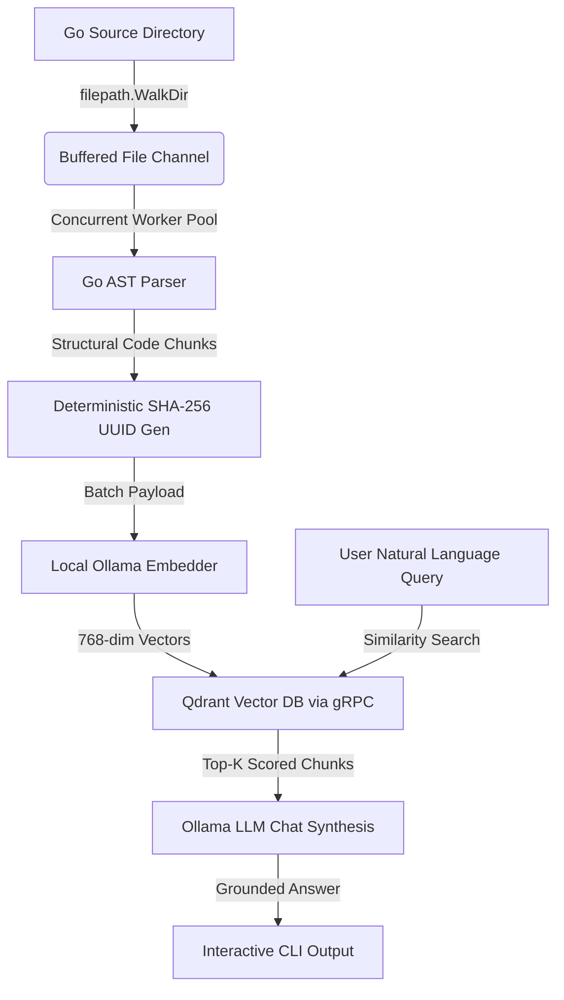

# astral

**Astral** is a local-first, structurally aware semantic code search and conversational retrieval engine built entirely in Go.

Unlike traditional RAG (Retrieval-Augmented Generation) systems that rely on fragile regular expressions or naive line-by-line text splitting, Astral utilizes Go's native compiler infrastructure (`go/parser`, `go/ast`) to digest and chunk source code exactly how the compiler reads it. This ensures absolute structural integrity for package-level declarations (functions, structs, interfaces) prior to vectorization.

---

## Key Features

* **Compiler-Driven AST Chunking:** Leverages the native Go AST parser to extract semantic code blocks. Code comments and documentation are preserved inside the content strings to maximize context density for the LLM.
* **High-Performance Concurrent Ingestion:** Features a bounded worker-pool pipeline that utilizes a single-channel file path router. It rapidly crawls local directories via `filepath.WalkDir` and concurrently streams files through the AST parsing, embedding, and storage pipeline.
* **Deterministic Idempotency:** Implements zero-dependency, standard-library SHA-256 cryptographic hashing to format unique, 36-character UUID-style point IDs. This prevents vector duplication or data bloat across multi-pass indexing runs.
* **Zero-Dependency Vectorization:** Bypasses heavy orchestration frameworks. Uses Go's native `net/http` package to communicate efficiently with a local Ollama instance running `nomic-embed-text` for 768-dimensional vector generation.
* **Stateful Vector Storage:** Integrates the official high-performance Qdrant Go SDK over gRPC (`Port 6334`) to execute fast, bulk-point upserts and Cosine Similarity lookups.
* **Grounded LLM Synthesis:** Connects natively to Ollama's conversational `/api/chat` endpoint to run lightweight, code-specialized models (like `qwen2.5-coder:1.5b`) for generating precise, context-grounded natural language answers.

---

## Architecture Overview

---

## Roadmap & Next Vision

* [x] Single-file end-to-end RAG verification.
* [x] Highly concurrent local directory ingestion (`Phase 2`).
* [ ] **Interactive CLI Wrapper:** Transitioning single-turn execution into a multi-turn, stateful CLI session allowing continuous follow-up questions.
* [ ] **Remote Repository Ingestion:** Abstracting the data layer to stream public/private codebases directly from remote Git provider APIs (GitHub/GitLab) using optimized, in-memory tarball streaming.
